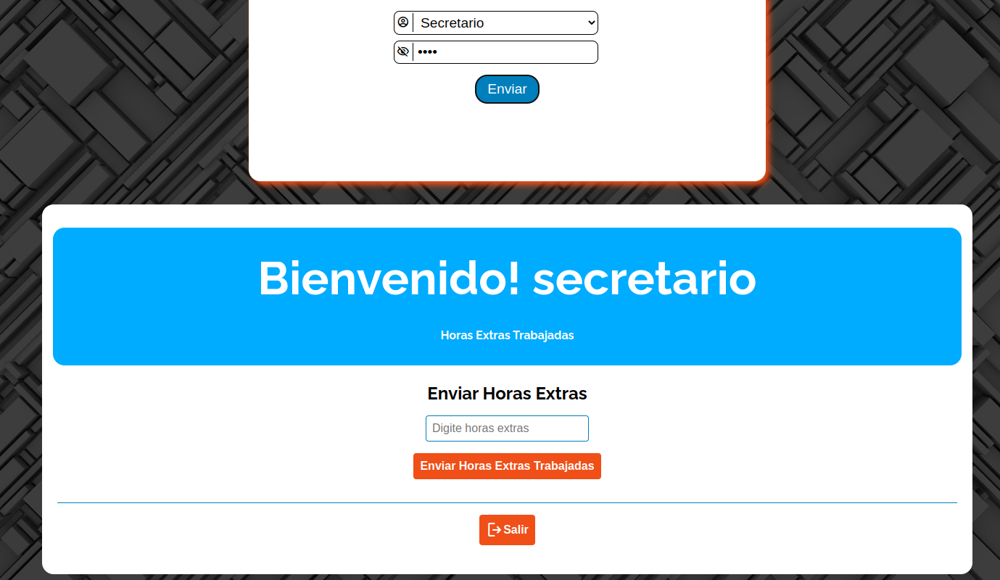

# Ejercicio-3

Repositorio de una app para liquidar a los empleados (Secretario, Vendedor , Ensamblador) de una empresa de venta de calzado.

Usuarios :

1. **Admin** : Es El administrador del sistema , puede modificar var globales, ver liquidaciones, reset liquidaciones
1. **Secretario** : Lleva a cabo las operaciones de la empresa, puede enviar sus H.E y ver su liquidacion
1. **Vendedor** : Se encarga de vender zapatos y zapatillas, puede enviar su total de ventas y ver su liquidacion
1. **Ensamblador** : Se encarga de ensamblar los zapatos y zapatillas de la empresa, puede enviar sus H.E, Enviar Si tiene hijos para bonificacion por hij y puede enviar su cantidad de zapatos y zapatillas ensambladas y recibir un incremento de sueldo depende del Numero de ensambles.

Clave de usuarios para entrar al sistema : **1234**

El proyecto es **Responsive web design**

[Demo del Proyecto](https://ejercicio3jasser.netlify.app)
